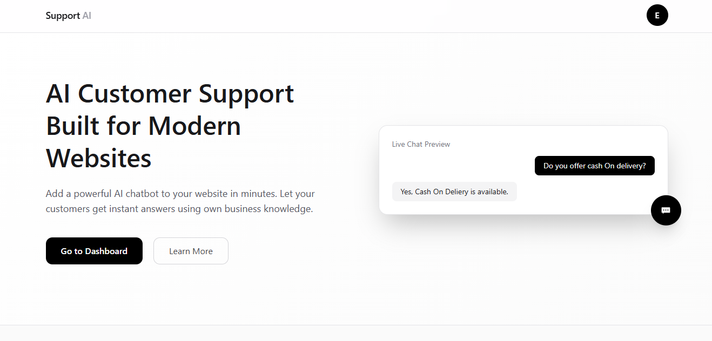
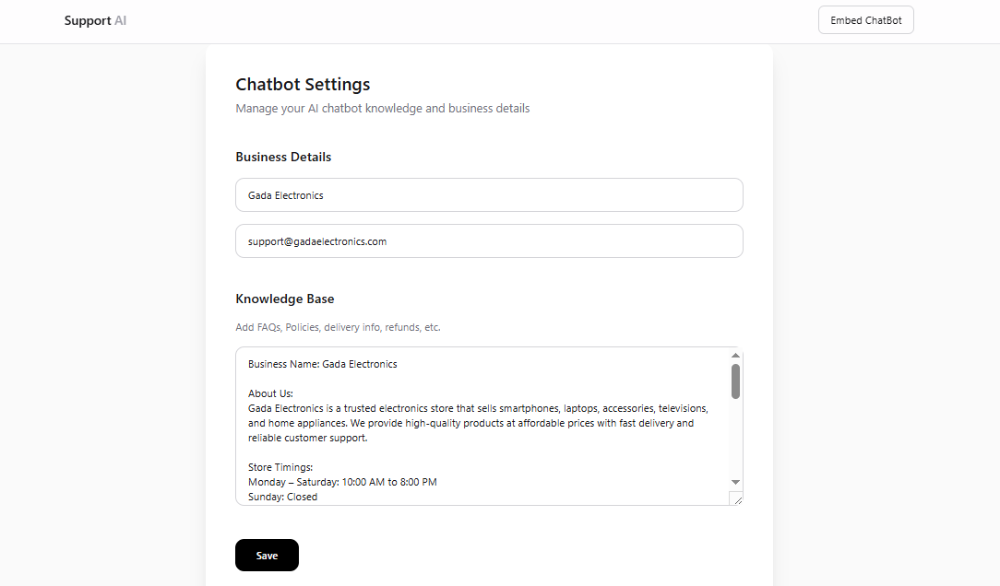
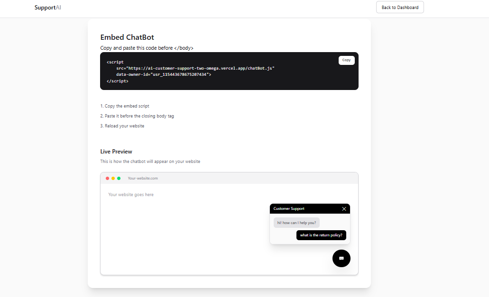
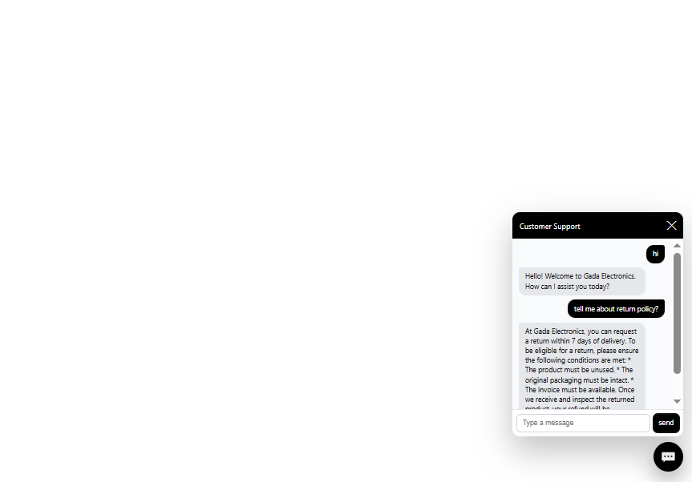

# EmbedAI – AI Customer Support Widget 🤖

[](https://ai-customer-support-two-omega.vercel.app)


AI-powered customer support widget that businesses can embed into their websites using a **single script tag**.

Businesses provide their **knowledge base**, and the AI assistant automatically answers customer questions related to their business.

---

# 🚀 Live Demo

👉 https://ai-customer-support-two-omega.vercel.app

---
# 📸 Project Preview

### Home Page
<p align="center">
  
</p>

### Dashboard
<p align="center">
  
</p>

### Embed Page
<p align="center">
  
</p>

### Customer Interface
<p align="center">
  
</p>

---


Example recording ideas:

* User asks a business question
* AI replies using the knowledge base
* Chat widget opening animation
* Embed script working on a website

---

# ✨ Features

| Feature                  | Description                                    |
| ------------------------ | ---------------------------------------------- |
| 🤖 AI Support Assistant  | Automatically answers customer questions       |
| 📚 Knowledge Base        | Businesses provide custom business information |
| 🔌 Easy Integration      | Just add one script tag to any website         |
| ⚡ Real-time Responses    | Fast AI replies to customer queries            |
| 🔐 Secure Authentication | Business accounts protected with Scalekit      |
| 🎨 Smooth UI Animations  | Chat widget built with Motion animations       |
| 🌐 Works on Any Website  | Can be embedded in any HTML website            |

---

# 🧩 How It Works

### 1️⃣ Business Owner Registers

Business owner signs up and submits:

* Business name
* Email
* Knowledge base

### 2️⃣ System Generates Owner ID

Each business receives a unique **Owner ID**.

### 3️⃣ Script Integration

Business owners add this script to their website.

```html
<script 
   src="https://ai-customer-support-two-omega.vercel.app/chatBot.js"
   data-owner-id="usr_115443678675207434">
</script>
```

### 4️⃣ Chatbot Appears on Website

The chatbot automatically loads and starts answering customer queries based on the provided knowledge base.

---

# 🏗 System Architecture

```
Customer Website
       │
       │  Embedded Script
       ▼
  Chatbot Widget (chatBot.js)
       │
       │ API Requests
       ▼
Next.js Backend API
       │
       │
       ▼
MongoDB Database
       │
       │
       ▼
AI Processing + Knowledge Base
       │
       ▼
Response sent to Chat Widget
```

---

# 🛠 Tech Stack

## Frontend

* Next.js
* TypeScript
* Motion (animations)

## Backend

* Next.js API Routes
* TypeScript

## Database

* MongoDB

## Authentication

* Scalekit

## Deployment

* Vercel

---

# 📂 Project Structure

```
project-root
│
├── app
│
├── components
│
├── lib
│
├── api
│
├── public
│
├── chatBot.js
│
└── README.md
```

---

# 📦 Installation

Clone the repository

```bash
git clone https://github.com/yourusername/embed-ai-support.git
```

Move into the project directory

```bash
cd embed-ai-support
```

Install dependencies

```bash
npm install
```

Run the development server

```bash
npm run dev
```

Open in browser

```
http://localhost:3000
```

---

# 📈 Future Improvements

* 📊 Chat analytics dashboard
* 🌎 Multi-language AI support
* 💬 Chat history storage
* 🎨 Customizable chatbot UI
* 🧠 Advanced AI training tools
* 🏢 Multiple assistants per business

---

# 🎯 Use Cases

* Business websites
* E-commerce support
* SaaS products
* Customer FAQ automation
* 24/7 AI support agents

---

# 🧠 What This Project Demonstrates

This project demonstrates skills in:

* Fullstack development with Next.js
* TypeScript application architecture
* API design
* Authentication systems
* Embeddable JavaScript widgets
* SaaS-style product architecture
* MongoDB data modeling
* Modern UI animations

---

# 👨‍💻 Author

**Pruthviraj Gaikwad**

Frontend Developer passionate about building modern web applications using:

* JavaScript
* TypeScript
* React
* Next.js

---

# ⭐ Support

If you like this project, consider giving it a **star ⭐ on GitHub**.

It helps others discover the project.
